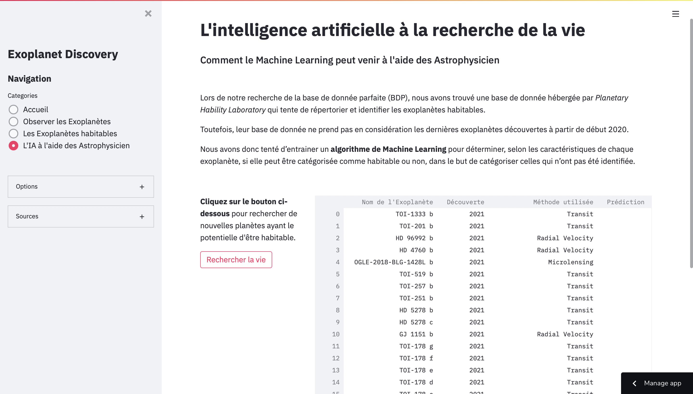

# Exoplanet Discovery
Creation d’un WebApp d’information sur les caractéristiques et l’identification des Exoplanètes habitables.

## Sommaire

* [Origine du projet](#origine-du-projet)
* [Screenshots](#interface)
* [Technologies](#technologies)
* [Bases de Données](#bases-de-données)
* [Statut](#statut)
* [La Team](#la-team)

## Origine du projet

Exoplanet_Discovery dans le cadre d’un **Hackathon** de 30 heures, organisé par la __Wild Code School__

L’objectif de fournir un support de présentation autour d’un thème portant sur l’espace. L’équipe a décide de se concentrer sur les caractéristiques des exoplanètes habitables afin d’entrainer un algorithme de *Machine Learning* pour déterminer si une nouvelle exoplanète est habitable.

La **WebApp** crée se divise en 3 sections : 
- Une présentation des techniques d’identification  des exopnalètes
- Une études des critères permettant de déterminer si une exoplanète est habitable
- Un algoritmo de ML (XGboost) qui détermine si les nouvelles exoplanètes découvertes sont habitables ou non.

## Interface

Ces analyses ont été mise à disposition au travers d’une __WebApp__ créée au travers de la plateforme __Streamlit__.

### Adresse du site :

Le site est hébergé directement sur les serveurs mis à disposition par *Streamlit* :

https://share.streamlit.io/mickaelkohler/exoplanet_discovery/main/Exoplanet_discovery.py

### Captures d’écran

## Technologies 

Projet fait entièrement en **Python**

Utilisations des librairies suivantes : 
 - Pandas
 - Sklearn
 - Plotly
 - Streamlit

## Bases de données 

La [base de données de **NASA Exoplanet Archive**](https://exoplanetarchive.ipac.caltech.edu/cgi-bin/TblView/nph-tblView?app=ExoTbls&config=PS) ont été utilisées pour obtenir l’ensemble des datas sur les exoplanètes.

La [base de données de **Planetary Habitability Laboratory**](http://phl.upr.edu/projects/habitable-exoplanets-catalog/data/database) a permis d’obtenir le nom des exoplanètes habitables. 

## Statut

Le hackathon a eu lieu du *11/04 au 12/04/2021*.

## La Team

Le projet a été réalisé par les élèves de la **Wild Code School** : 
- Antoine Carre
- Franck Maillet
- Michael Kohler
- Mickaël Caceres
